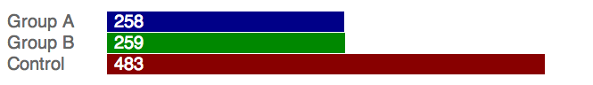
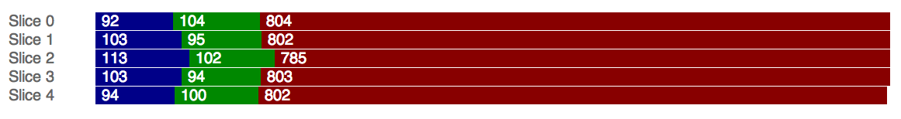

This `lab-rats` project provides a [jQuery plugin][1] for doing
*multi-variate testing* ([A/B Tests][2]) on the client's browser...
in other words, treating your customers like lab rats in order to
engineer the best web application.

Quick Start
----------

To give an example of how to use this plugin, let's pretend you want
to measure the results of changing the look of the *sign up button*.
This experiment will split your visitors into two equal
"groups". Group 0 will be shown the Shiny Red button, and Group 1 will
be shown the Flashy Blue button. We call this test, the **Big Button**
experiment.

Taking advantage of the `labrats` plugin is a simple two step process:

### Step 1. Create a Function for each Group

Each group will have a special function that will change or render the
page slightly differently:

    function shinyRed() {
        $('#big-button').addClass('shiny-red');
    }

    function flashyBlue() {
        $('#big-button').addClass('flashy-blue');
    }

Normally, you would put an element to report which element is shown to
which user, but we'll get to that in a minute.

### Step 2. Call the `labrats()` for Test Subject

The final step amounts to having the `labrats()` function call one of the
callback functions for the user based on their group.

    $.labrats( { name: 'Big Button',
                 callbacks: [ shinyRed, flashyBlue ] } );

That is all that is needed to get a barebones test showing different
button styles to different users.

On Reporting
---------

Of course, a multivariate test is not really an experiement without
the scientific principles of observations and reporting.

While I really can't help you in this regard, let me assume that
you've written a `tracking()` function that can send a message to
something like [Google Analytics][3].

Now, we just need to change our functions a wee bit:

    function shinyRed() {
        tracking('shown', 'shiny-red', guid);
        $('#big-button').addClass('shiny-red').click( function(){
            tracking('clicked', 'shiny-red', guid);
        });
    }

    function flashyBlue() {
        tracking('shown', 'flashy-blue', guid);
        $('#big-button').addClass('flashy-blue').click( function(){
            tracking('clicked', 'flashy-blue', guid);
        });
    }

Notice each function tracks if the button was shown *and* whether it
was clicked. You really should track both to get a clear coorelation
between the size of your test and its success.

On Identifying Users
-------------

The plugin keeps track of a user account by storing a unique ID in the
browser's stash of cookies, however, you *can* specify the ID you want
it to use. For instance, assuming that you had a `guid` variable like:

    var guid = 'bcfb3529-0fed-4b05-8414-db3e1d2b11da';

You can pass in this value as a `key` to the `$.labrats()` function:

    $.labrats( { key: guid, name: 'Big Button',
                 callbacks: [ shinyRed, flashyBlue ] } );

**Note:** If a `key` is not specified, the user ID calculated is simply a
large random number. It is NOT a GUID and may not be unique among all
your users. Since it is internal to this plugin and meaningless, it is
obviously not very  useful for tracking and reporting results. This is
why we recommend specifying your own ID key.

On Hashing Issues
-----------------

The hashing algorithm that comes with this plugin is pretty... uh,
simplistic. Actually, it is downright stupid, and the resulting
distribution isn't great. However, you can specify a hashing
algorithm.

The function you give the `hash` must be able to accept a string
and return an integer number, for instance:

      $.labrats.configure( {
           hash: function(key) {
                     return murmurhash3_32_gc(key, 73);
                 }
      });

It seems the [MurmurHash][4] is quite good at distribution, and
[initial experiments][5] show it a good algorithm for this plugin.

  [1]: http://www.jquery.com
  [2]: http://en.wikipedia.org/wiki/A/B_testing
  [3]: https://developers.google.com/analytics/
  [4]: http://en.wikipedia.org/wiki/MurmurHash
  [5]: dispersion/dispersion.html

Recipes and Examples
------------------

This section contains a series of contrived examples. Each assume that
you've created some functions that *render the tests* for a user.

### Two Parallel 50/50 Tests

You want to run two tests, "Big Button" (shows either a red or blue
sign up button) and "New Logo" (which shows the "new" or "old"
logo). Each test will involve all web site visitors split down the
middle. This gives four possibilities:

<table cellpadding="10" cellspacing="1" style="font-family:sans-serif">
  <tr>
  <th style="background:#800; color:white">Red Button and New Logo</th>
  <th style="background:#008; color:white">Blue Button and New Logo</th>
  </tr>
  <tr>
  <th style="background:#fcc">Red Button and Old Logo</th>
  <th style="background:#ccf">Blue Button and Old Logo</th>
  </tr>
</table>

The code to run these tests involves two calls to the plugin:

    $.labrats( { name: 'Big Button',
                 callbacks: [ shinyRed, flashyBlue ] } );

    $.labrats( { name: 'New Logo',
                 callbacks: [ oldlogo, newlogo ] } );

### Having a Control Group

A *control group* contains the users who see the "old stuff". This is
still a "group". For instance, in the previous example, the "control"
is the group that see the old logo.

However, if the logo is particularly daring, and you only wanted to
show it to 10% of your users, you would use the `subset` option:

    $.labrats( { name: 'New Logo', subset: 10,
                 callbacks: [ newlogo ], control: oldlogo } );

Note: The `callbacks` can accept one function (creating a single test
group), but it still only accepts and array.

The `control` parameter is optional. This could be useful if the old
logo is already being displayed and the `newlogo()` function simply
replaced it.

### Having a Control plus Test Groups

Suppose your graphics department churned up two hot new company logos
you want to A/B test, but you still wanted the bulk of your users to
see the old one until after the testing is complete.

    $.labrats( { name: 'New Logo', subset: 50,
                 callbacks: [ newlogoA, newlogoB ],
                 control: oldlogo } );

In the above code, 50% of the users will see the old logo (by calling
the `oldlogo()` function). The remaining users are split, so 25% of
your users will see the "A" logo version (by calling `newlogoA()`) and
25% will see the "B" logo version (by calling `newlogoB()`).

Keep in mind that since we are dealing with random numbers, 25% means
*about* 25%. For instance, in some of the tests that we ran with 1,000
user IDs, we got the following actual distribution:

### Multiple Non-Overlapping Tests

In our first recipe, we wanted to test both our sign up button (which
could be red or blue) as well as our logo change. What if these tests
were so major that you didn't want a customer to see either the red or
blue buttons if they also saw the new logo?

Here we introduce the concept of a *slice*. Each slice can contain a
non-overlapping test... but only from tests in other slices. A slice
*must* be named. Here is the example code:

    $.labrats( { name: 'Major Tests', slices: 2, slice: 0,
                 callbacks: [ shinyRed, flashyBlue ] } );

    $.labrats( { name: 'Major Tests', slices: 2, slice: 1,
                 callbacks: [ oldlogo, newlogo ] } );

In this code, the `name` refers to the slice collection and the test
is specified with the `slice` parameter. This divides our users into 4
groups of 25% each:

<table cellpadding="10" cellspacing="1" style="font-family:sans-serif">
  <tr>
  <th style="background:#800; color:white">Red Button Group</th>
  <th style="background:#008; color:white">Blue Button Group</th>
  </tr>
  <tr>
  <th style="background:#880; color:white">New Logo Group</th>
  <th style="background:#080; color:white">Old Logo Group</th>
  </tr>
</table>

**Note:** Some companies create this "major" slicing division with
  lots of small slices (like 20 slices of 5% each), and then allocate
  them to tests over time.
  

Function API
------------------

This section details all available functions in this plugin. While the
primary function is `$.labrats()`, fine-grain control may be had with
the other functions described below.

### `$.labrats()`

Calls a function based on an assigned test group for a user.
The identification key for the user (as well as the name(s) of
the test) can be passed in as function arguments along with two
or more callback functions (note that their order matters).

For instance, for a test that splits the user accounts into three
groups, you could do:

    $.labrats.configure( { groups: 3 } ); // Optional
    $.labrats(userid, "Some Test", fn1, fn2, fn3);

The other approach to calling this function is with named parameters.
For instance, the same example could be written:

    $.labrats({ key: userid, name: "Some Test", groups:3,
                callbacks: [ fn1, fn2, fn3 ] });

This function returns the results of calling one of the callback
functions.

Note: The size of available pool for tests can be limited (effectively
creating a a pool of people in test groups and another control
group).  For instance:

   $.labrats.group( { key: userId, name: "Another Test", subset: 10,
                      callbacks: [ fn1, fn2, fn3 ],
                      control: fn4 });

Will call the `control` function if the user is part of the 90%
control group, otherwise, it calls the appropriate function in
the `callbacks` array.

(See the `group()` function for details as to the other acceptable values
for named parameters)

### `$.fn.labrats()`

Behaves like the utility function, `$.labrats()`, but the callback
function is given the jQuery selector results. This allows the callback
function to behave as part of a jQuery chain. For instance:

    function fn1() {
       return this.addClass("shiny-red");
    };
    function fn2() {
       return this.addClass("flashy-blue");
    };

    var testCfg = { key: id1, callbacks: [ fn1, fn2 ] };
    $("#logo-test").labrats(testCfg).click(...);

**Note:** Only *named parameters* work as arguments.

### `$.labrats.group()`

Determines the *group number* assigned to a given user. The number
of groups can be specified using the `configure()` function (see below).
The user's `key` is passed in as the parameter, but this should
also take the name of the test as well.

This can either be specified as parameters, as in:

    $.labrats.group( userID, "Large Logo Test" );

Or as a series of keys in an array. The following is equivalent:

    $.labrats.group( [ userID, "Large Logo Test" ] );

Or as a collection of named parameters:

    $.labrats.group( { key: userID, name: "Large Logo Test",
                       groups: 2 } );

This last approach allows you to specify the number of
groups (instead of calling the `configure()` function).

#### Accepted Parameters:

 - `key` - The identification of the user account
 - `name` - The name of the test. The name is appended to the key in order to compute the hash value. This guarantees that each test has a different distribution of user accounts.
 - `groups` - The number of active groups a non-controlled test account can be in. If not given, this defaults to 0.
 - `subset` - A percentage (from 0 to 100) that Specifies the size of the test pool. User accounts that hash outside this value are part of the control. If not specified, this defaults to `100` (meaning, no control group).
 - `slices` - Divides the test pool into discreet slices where a user account can be in only one slice. This allows distinct test groups that don't overlap essentially guaranteeing that a user account could be in at most, one test group. The slices works for a given `name` parameter.
 - `slice` - The name of the slice this user should belong in order to qualify for being part of a test group.
 - `hash` - The function used to convert the *string* into a number than can be divided into the different test buckets.

#### Limit Test Pool with `subset`

You can limit the size of available pool (effectively creating a
a pool of people in test groups and another *control group*).  For
instance:

    $.labrats.group( { key: userId, name: "Another Test",
                       groups: 2, subset: 10 });

Will return `-1` if the user is part of the 90% control group,
otherwise, it returns either `0` or `1` if it is in one of the
5% sized test groups.

#### Slicing Test Pool

With multiple tests, a random distribution algorithm means that some
users will end up in more than one test group. The `slices` option
divides the test pool into discreet subgroups, and the `slice` option
specifies which slice to use for a particular test.

For instance, suppose you have some experiments that are quite invasive,
(perhaps even conflicting if a person ended up as a lab rat in more than one),
we could define the first experiment to use the first slice:

    $.labrats.group( { key: userId, name: "serious tests",
                       slices: 3, slice: 0, groups: 2 });

The second experiment would use the next *slice*:

    $.labrats.group( { key: userId, name: "serious tests",
                       slices: 3, slice: 1, groups: 2 });

Notice the test name for the group of slices must be the same.

This slicing feature can be combined with the `subset` feature to
keep a control group out. Also, when using the subset and the slicing
features, the `groups` option can be unspecified in order to default
to `1` (a single test group).

With five experiments where each experiment is in a slice with
two test groups, we might have a distribution illustrated in
this diagram:

### `$.labrats.inGroup()`

A test to see if a particular 'key' is part of the given group.
Returns `true` if a given key is in the group number, `false`
otherwise.

This function can be called either with named parameters, as in:

    $.labrats.inGroup( 2, { key: userid, name: testname }

Where the first argument is the group number to check, and the
second argument is an object similar to what is passed to the
`$.labrats.group()` function, including:

  - `key` is the identification of the user
  - `name` is the test's name
  - `subset` is the size of the pool, where `100 - subset` is the
     size of the control group

This function can also be called as a series of parameters:

    $.labrats.inGroup( 2, userid, testname )

### `$.labrats.key()`

Converts a series of arguments into a *key* to use in a
hash. Each function may call this using a few formats.
For instance, as a series of string arguments:

    var key = $.labrats.key("test", "abc", id);

or as an array:

    var key = $.labrats.key([id, "test", "abc"]);

or even as the function's arguments:

    var key = $.labrats.key(arguments);

### `$.labrats.getId()`

Returns an unique identification for the current user's browser.
If this is the first time a user has seen the application, we
generate a new ID (as a random number), otherwise, we return the
ID stored in a cookie.

### `$.labrats.configure()`

This function allows a single object to overwrite some, but not
all configuration values. Acceptable values include:

 - `hash`: A function used to convert a user ID key and test name into a number
 - `groups`: The number of test groups to divide the user pool

